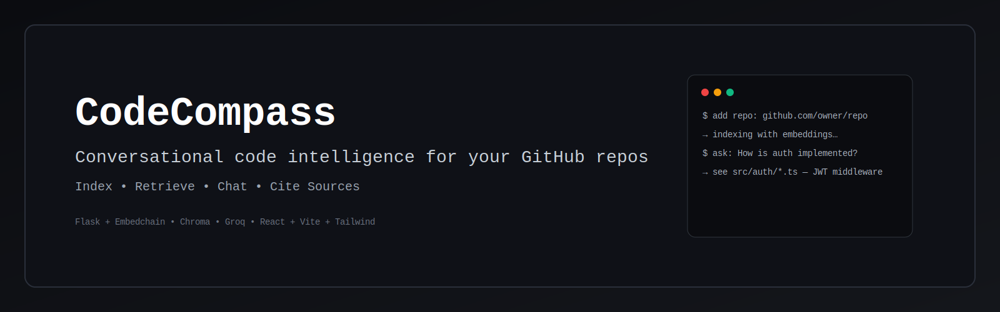
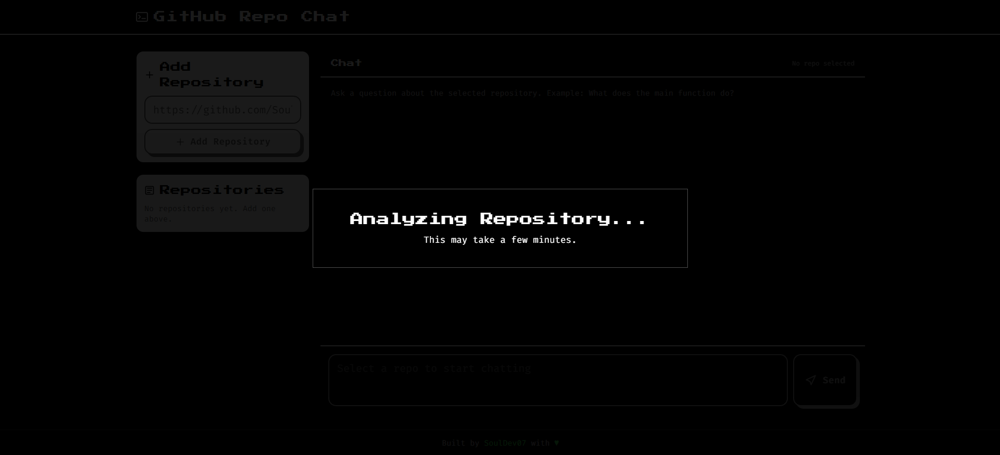
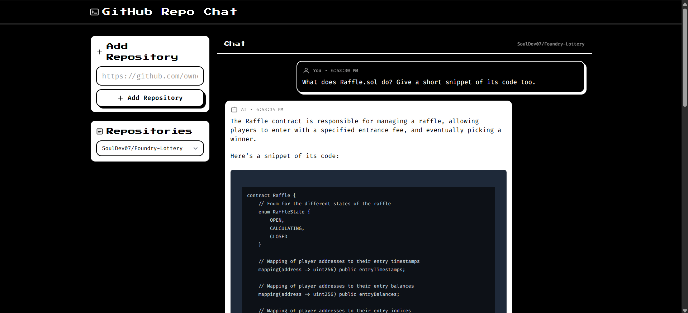

# 🧭 CodeCompass - GitHub Repo Chat



CodeCompass turns a GitHub repository into an interactive, searchable knowledge base. Add a public repo, index it locally with embeddings (Chroma), and chat with an LLM grounded on real files from that repo.

🔒 Privacy‑first • 🎯 Repo‑scoped answers • 💾 Local vector store • 🔖 Clear citations

---

## ✨ Highlights

- Repo‑scoped conversational search - answers stay focused on the repo you select
- Source grounding - responses reference retrieved passages and files
- Persistent index - once indexed, the repo remains searchable
- Simple ingestion - accepts `owner/repo` or full GitHub URLs; normalization prevents duplicates

---

## 📸 Screenshots





---

## 🏗️ Architecture

```
React (Vite + Tailwind)
       ↕
Flask REST API
       ↕
Embedchain (ingest + retrieve)
       ↕               ↘
   Chroma (vectors)   Groq LLM
```

---

## 🛠️ Technical notes

- Embeddings: sentence‑transformers `all‑MiniLM‑L6‑v2` (fast and compact)
- Vector DB: Chroma persisted under `backend/db` for local, fast retrieval
- LLM: Groq (configurable). Prompt encourages concise, source‑grounded answers
- Metadata: each chunk stores `github_repo`, `file_path`, `chunk_index` for precise citations

---

## 🧰 Troubleshooting

- 401/403 from LLM → check `GROQ_API_KEY` in `backend/.env`, restart Flask
- Cannot add repo → ensure it’s a public GitHub repository or provide a `GITHUB_TOKEN`

---

## 🗺️ Roadmap

- File/line citations with clickable open‑in‑editor behavior
- Partial/continuous indexing for very large repos
- Answer streaming UI for progressive responses
- Docker images and a simple hosted deployment option